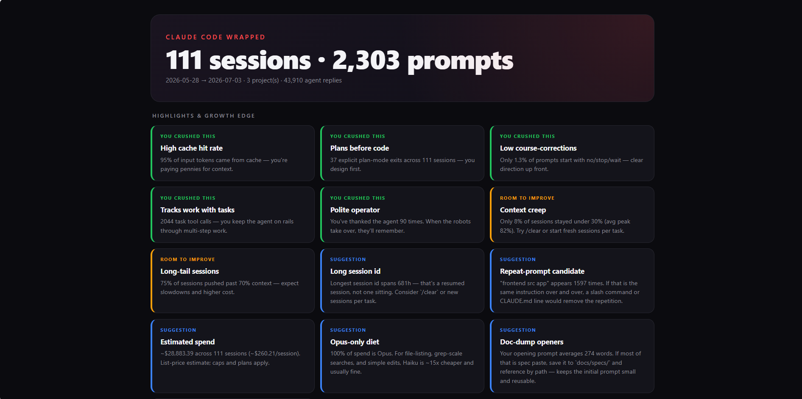

# agent-wrapped &mdash; Claude Code Wrapped, locally

**Your AI coding agent, wrapped &mdash; on your own machine. A local, private, open-source alternative to hosted "coding wrapped" tools like Paxel. Zero uploads, zero dependencies, one Python file.**

`agent-wrapped` reads the session transcripts Claude Code stores on your
disk and prints a Spotify-Wrapped-style **Claude Code usage report**: peak
hours, top model, prompt style, plan-mode habits, top phrases, context peaks,
cache hit rate, session length, weekly diffs, and the **API-list-price value**
of every token you've spent.

Runs in seconds. One Python file, standard-library only, no dependencies,
no Docker, no account, no sign-in, no upload.

> **v0.1 supports Claude Code.** Codex CLI and Cursor are on the roadmap
> (different transcript schemas &mdash; separate PRs). See [Roadmap](#roadmap).

[](LICENSE)
[](https://www.python.org/downloads/)
[](agent_wrapped.py)
[](PRIVACY.md)
[](https://github.com/mallikharjun073/agent-wrapped)

> **Keywords for the search engines:** claude code wrapped, claude code
> analytics, claude code usage report, claude code cost tracker, claude
> code statistics, ai coding agent wrapped, paxel alternative, offline
> coding wrapped, local llm analytics, anthropic usage report.

---

## Table of contents

- [Who is this for?](#who-is-this-for)
- [Screenshots](#screenshots)
- [Install](#install)
- [Usage](#usage)
- [What you get](#what-you-get)
- [Privacy](#privacy)
- [How it works](#how-it-works)
- [Comparison to Paxel and other tools](#comparison)
- [FAQ](#faq)
- [Roadmap](#roadmap)
- [Contributing](#contributing)
- [License](#license)

---

## Who is this for?

- Developers who use **Claude Code** daily and want to see their own patterns.
- Engineers on **enterprise / regulated laptops** (finance, healthcare, gov)
  who can't upload transcripts to third-party services.
- People curious about **how much API value they're getting** out of a
  Claude Pro or Claude Max subscription.
- **Open-source enthusiasts** who want a single-file, auditable tool
  instead of a Docker container with a proxy.
- Anyone who saw **Paxel (YC)** and thought *"cool idea, but I'm not
  shipping my prompts to a startup."*

---

## Screenshots

> Screenshots coming soon. Run `agent-wrapped --html` and see for yourself
> in the meantime &mdash; the report opens in your browser and looks like a
> dark-theme dashboard with a hero, a grid of stat cards, and a highlights
> section. See [`screenshots/README.md`](screenshots/README.md) for how
> the finished images will look and where they go.

<!-- When PNGs are added to ./screenshots/, uncomment the block below.

**HTML report &mdash; hero + card grid + insights + charts:**



**Terminal report &mdash; text-only, ANSI-safe:**


**Insights section &mdash; green / amber / blue callouts:**


-->


---

## Install

Pick whichever feels right.

### 1. One-shot (no install)

The fastest way to try it. Downloads a single file and runs it.

```bash
curl -fsSL https://raw.githubusercontent.com/mallikharjun073/agent-wrapped/main/agent_wrapped.py -o agent_wrapped.py
python agent_wrapped.py --html
```

### 2. `pipx` (recommended for regular use)

Adds an `agent-wrapped` command to your PATH, isolated from your global Python.

```bash
pipx install agent-wrapped
agent-wrapped --html
```

### 3. From source

For contributors or people who like to read code before running it.

```bash
git clone https://github.com/mallikharjun073/agent-wrapped.git
cd agent-wrapped
python agent_wrapped.py --html
```

Requires Python 3.9+. **No pip packages to install.** No Docker. No node.

---

## Usage

Print a **text report** to your terminal:

```bash
agent-wrapped
```

Render an **HTML dashboard** and open it in your browser:

```bash
agent-wrapped --html
```

Last **30 days** only:

```bash
agent-wrapped --html --days 30
```

Show what **changed since your last run** (weekly diff):

```bash
agent-wrapped --diff
```

Filter to one project (substring match on the project folder name):

```bash
agent-wrapped --html --project my-repo
```

All options:

| Flag | What it does |
|---|---|
| `--html` | Render an HTML card report and open it in your browser |
| `--days N` | Only include sessions from the last N days |
| `--project SUB` | Filter to one project folder (substring match on the folder name) |
| `--top N` | How many top phrases to show (default 10) |
| `--diff` | Print the delta since the previous run |
| `--no-history` | Don't append this run to `~/.agent-wrapped/history.jsonl` |
| `--no-open` | With `--html`, don't auto-open the browser |
| `--out PATH` | With `--html`, write to a specific file |
| `--version` | Print version and exit |

---

## What you get

**Terminal:**

```
AGENT WRAPPED  ·  Claude Code
Sessions           111   across 3 project(s)  (2026-05-28 → 2026-07-03)
Your prompts      2292
Agent replies    43780
Avg prompt       366.9 words   short (<10w): 35%

-- MODELS --
  claude-opus-4-7               82.4%  ####################
  claude-opus-4-8               17.5%  ####................
```

**HTML report:** hero + a grid of cards &mdash;

- Top model, Peak hour, Night owl %, Top day
- Avg prompt length, Politeness %, Course-corrections %
- Plan-mode calls, Max parallel agents, Longest session
- **Peak context %**, **Cache hit rate**, **API-list value**
- Turns per session, First-prompt length, Slash usage

Followed by an **insights section** (green = strengths, amber = areas to
improve, blue = suggestions), then the hourly histogram, model split, top
tools, and top phrases.

**Sample insights** &mdash; these are rule-based and specific, not generic:

- *"**High cache hit rate**: 95% of input tokens came from cache &mdash; you're paying pennies for context."*
- *"**Context creep**: only 8% of sessions stayed under 30% of the window. Try /clear between tasks."*
- *"**Repeat-prompt candidate**: `frontend src app` appears 1,597 times. If that's the same instruction, a slash command would remove it."*
- *"**Plan value delivered**: those tokens would cost ~$28,878 on the raw API. If you're on Pro/Max, that's the subscription paying off."*
- *"**Opus-only diet**: 100% of spend is Opus. For file-listing and grep-scale searches, Haiku is ~15x cheaper and usually fine."*
- *"**Cold-start prompts**: your opening prompt averages 8 words. On complex work, a 2-3 line brief (goal + constraints + done-when) beats iterating."*

---

## Privacy

`agent-wrapped` reads exactly one thing: your local Claude Code transcript
folder (`~/.claude/projects/`). It writes exactly two things:

1. Your HTML report (path you choose).
2. `~/.agent-wrapped/history.jsonl` &mdash; one-line snapshots for `--diff` (opt-out with `--no-history`).

It makes **zero network calls**. No fonts, no CDNs, no telemetry, no beacons.
The generated HTML is fully offline. Grep the source for `urllib|requests|http|socket` and you'll find nothing.

Full breakdown: [PRIVACY.md](PRIVACY.md).

---

## How it works

Claude Code writes every conversation as a `.jsonl` file under
`~/.claude/projects/<project-slug>/<session-id>.jsonl`. Each line is a
JSON record: user prompts, assistant responses, tool calls, token usage,
timestamps. `agent-wrapped` streams those files line-by-line and tallies:

- Per-model output & input token totals &rarr; **cost estimate** (list-price)
- Per-turn input + cache tokens &rarr; **context peak** per session
- User-message word counts, first-word patterns, `/slash` prefixes
- Assistant-message `tool_use` blocks &rarr; tool call frequency, `Agent`
  concurrency per turn, `ExitPlanMode` count
- Timestamps &rarr; hour and weekday histograms

Then a small rule engine (`derive_insights` in `agent_wrapped.py`) produces
green / amber / blue callouts based on thresholds. Read it &mdash; it's ~100 lines.

---

## Comparison

|  | agent-wrapped | Paxel (YC) |
|---|---|---|
| Data upload | **Never** | Transcript excerpts sent to Claude/GPT + scored JSON to YC |
| Install | `pipx install` or `curl` | Docker + account + sign-in |
| Runtime | Seconds | 15&ndash;30 minutes |
| Compare to other users | No (by design) | Yes |
| Compare to your last week | **Yes (`--diff`)** | No |
| Multi-tool | Claude Code (v0.1) &middot; Codex/Cursor on roadmap | Claude + Codex + Cursor |
| Source | 1 Python file, ~700 lines | Closed |
| Cost tracking | **Yes (list-price + cache-adjusted)** | Yes |
| Insights section | **Rule-based, specific** | LLM-scored (sends data out) |

Both tools are useful. If you want a comparative dataset, use Paxel.
If you want your prompts to stay on your laptop, use this.

---

## FAQ

### What does this tool do?

It reads your local Claude Code session transcripts and generates a
personal usage report &mdash; how often you use Claude, which model, at
what hours, how you prompt, how much context you burn, and how much all
of it would cost at raw API list price.

### Does agent-wrapped upload my prompts anywhere?

**No.** Every byte of computation is local. The source has zero network
imports (`urllib`, `requests`, `socket`, etc). See [PRIVACY.md](PRIVACY.md).

### How is this different from Paxel by Y Combinator?

Paxel is hosted and sends transcript excerpts to third-party LLMs to
score you against other users. `agent-wrapped` runs locally and compares
you to yourself over time. Paxel wins on cross-user comparisons; this
wins on privacy, install speed, and audit-ability. See the
[comparison table](#comparison).

### Where does Claude Code store the transcripts it reads?

`~/.claude/projects/<project-slug>/<session-id>.jsonl` on macOS/Linux,
`C:\Users\<you>\.claude\projects\...` on Windows. Claude Code writes them
automatically as you use it &mdash; `agent-wrapped` just reads what's already there.

### Does it support Codex CLI and Cursor?

Not yet. Codex uses a different transcript schema
(`agent_message` / `input_text` / `event_msg` / `patch_apply_end`), and
Cursor stores chat history in SQLite under `workspaceStorage/`. Both are
on the [roadmap](#roadmap). PRs welcome.

### How much did I actually spend on Claude?

The "API-list value" card shows what your tokens would cost at raw API
prices, **not** what you actually paid. If you're on a Claude Pro ($20/mo)
or Claude Max ($100&ndash;200/mo) subscription, your real spend is the
flat monthly fee. The card is telling you "how much value did the
subscription deliver" &mdash; often 100&times;+ ROI.

### Can I use this on Windows?

Yes. Tested on Windows 10/11, macOS, and Linux. Python 3.9+ is the only
requirement.

### Is there a Node/Rust version?

No, and probably won't be. The pitch is "one Python file, stdlib only,
read the code yourself." Rewriting in another language works against that.

### How do I keep this tool from tracking me across runs?

Pass `--no-history` and it won't write to `~/.agent-wrapped/history.jsonl`.
You'll lose the `--diff` feature, but nothing else.

### Can I run this on a coworker's laptop?

Legally yes if they let you. Ethically, ask first &mdash; their transcripts
are their conversations with the model, which may contain their thinking,
their client's code, or their WIP ideas. Treat it like reading their
`.bash_history`.

### Will you add [feature]?

Open an issue. Best chance of a merge: zero-dependency, stdlib-only,
doesn't add network calls, and includes a screenshot of the output.

---

## Roadmap

- [ ] **Codex CLI parser** &mdash; `~/.codex/sessions/**/*.jsonl` uses a different
      schema (`agent_message`, `input_text`, `event_msg`, `patch_apply_end`
      &hellip;); worth a dedicated PR.
- [ ] **Cursor parser** &mdash; chat history lives in SQLite under
      `workspaceStorage/`; needs schema mapping.
- [ ] `--share` &mdash; render a 1080&times;1350 PNG for social posts.
- [ ] Weekday radial chart.
- [ ] Optional archetype classification (fully local, no LLM call).
- [ ] Per-project drill-down (`--split-by project`).
- [ ] `agent-wrapped serve` &mdash; localhost HTTP server that auto-refreshes
      the report as new sessions land.

PRs welcome. Keep the "zero dependencies" bar.

---

## Contributing

1. Fork, branch, PR against `main`.
2. Keep the module **single-file and stdlib-only**.
3. If you add a new parser, put it in the same file behind a small
   `parse_<toolname>()` function that yields the normalized event
   shape the current analyzer consumes.
4. **No new network calls, no telemetry, no analytics** &mdash; that's the
   whole product.
5. Verify with `grep -nE "urllib|requests|http\.|socket|urlopen" agent_wrapped.py`
   before opening a PR.

---

## Related searches this project helps with

*So people finding this via a search engine know they're in the right place.*

- Claude Code Wrapped &middot; Claude Code year in review &middot;
  Claude Code stats
- How much Claude Code costs &middot; Claude Code token usage &middot;
  Claude API cost calculator
- Claude Code analytics &middot; Claude Code dashboard &middot;
  Claude usage report
- Paxel alternative &middot; open-source coding wrapped &middot;
  self-hosted coding wrapped
- Local LLM analytics &middot; offline Claude report &middot;
  private Claude Code report
- Anthropic subscription ROI &middot; Claude Pro vs API cost &middot;
  Claude Max value
- AI coding agent statistics &middot; developer productivity dashboard

---

## License

[MIT](LICENSE). Use it, fork it, ship it. Attribution appreciated but
not required.

## Credits

Inspired by (and a friendly response to)
[Paxel](https://paxel.ycombinator.com/) &mdash; the same idea, minus the
upload.
